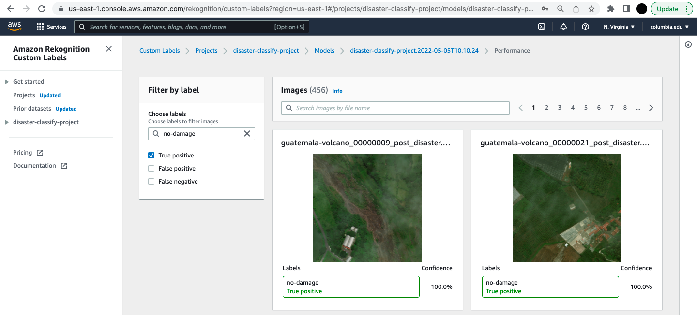
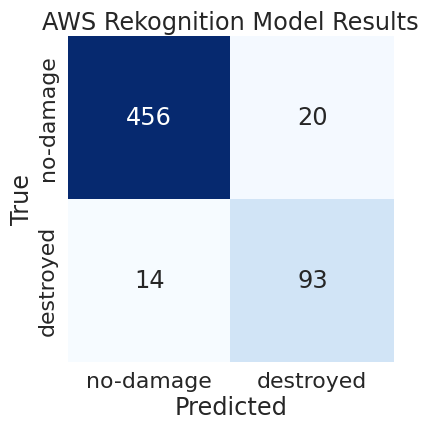
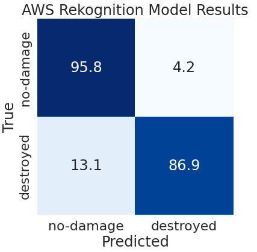
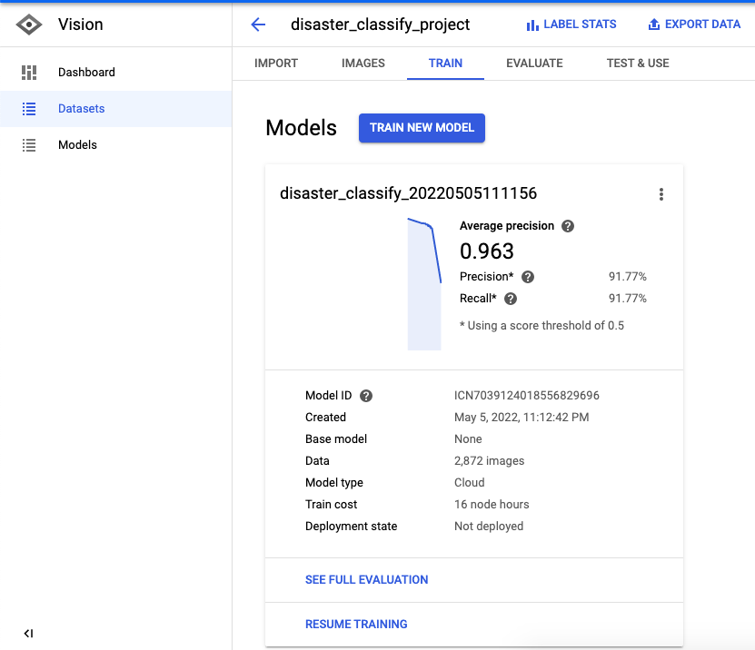
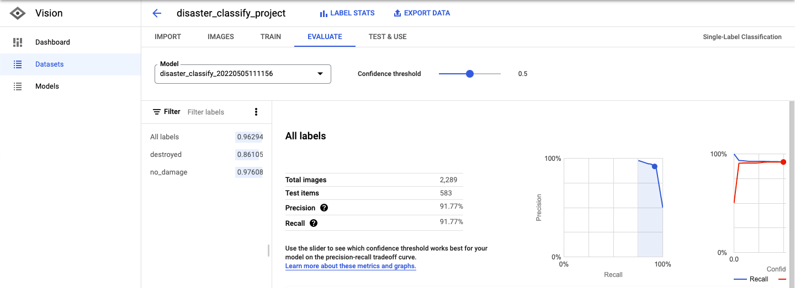
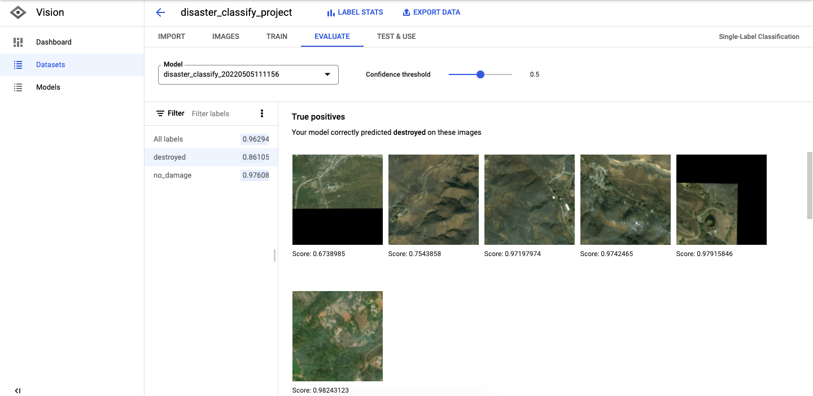
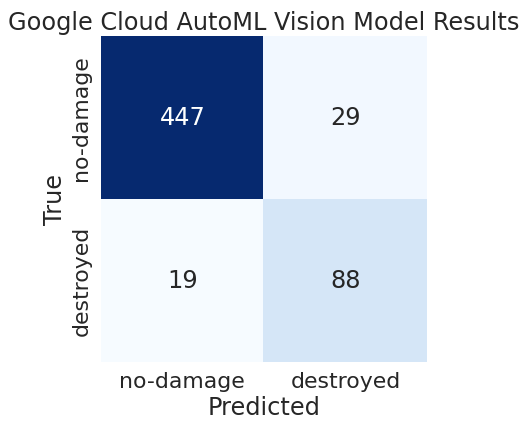
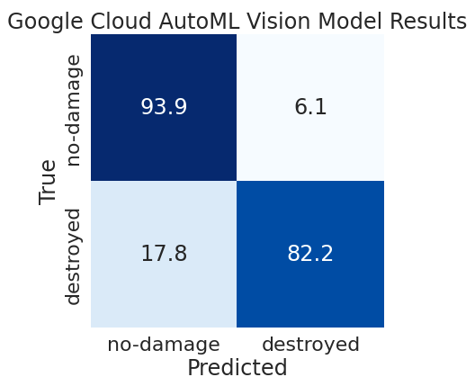

# Using AutoML to Classify Damage Levels in Natural Disaster Images
Final Project for COMS E6998 Practical Deep Learning Sys Performance, Spring 2022 (Raiha Khan (rk3148))

## Project description
After major natural disasters, such as hurricanes, volcano eruptions, tornados, wildfires, or others, it is a very important task for disaster managers and practitioners to perform damage assessment in order to deliver humanitarian assistance. One way they do this is by observing satellite imagery of disaster sites by comparing pre-disaster images with post-disaster images. 

In this project, my goal was to explore different AutoML platforms and packages to train a deep learning model that can identify whether or not a geographic area has been significantly damaged using satellite images.

### Data used
The xBD dataset (https://arxiv.org/pdf/1911.09296.pdf) is a dataset containing both pre- and post-natural disaster images showing damaged buildings, where the labels to the dataset are provided in the form of image-level JSON annotations, and each JSON describes the damage levels of each building in the image. Each building in the image falls under one of the following damage labels: "no damage," "minor damage," "major damage," or "destroyed." 

For this project, I chose to reduce the complexity of this dataset. The way the xBD dataset was originally labeled, each image had as many labels as it displayed buildings, and each building in the image has one of four possible labels corresponding to damage levels. I simplified and customized the dataset so that each image had one label of two labels: "no damage" or "destroyed." I picked these two labels because they are the most extreme labels on either spectrum of damage regardless of the natural disaster, since it could be that "major damage" incurred by buildings from a volcano eruption might look a little bit different from "major damage" incurred by buildings from a hurricane.

I did this by first collecting counts for each image of how many buildings were originally labeled by each damage level. Then, I took the damage level that was the most prominent among all of the buildings in each image, and then I filtered my dataset down to those images whose most prominent building damage level was either "no damage" or "destroyed."

The xBD dataset already has train-validation-test splits from how I downloaded it from the xView2 prize challenge website (https://xview2.org/). I retained these splits in my project and kept those images that had a majority of their buildings labeled as "no damage" or "destroyed."

## Repository description
**autogluon-model-training-and-prediction.ipynb**: Notebook with code to load train/val/test data, train a predictor to classify images according to the custom "no-damage" and "destroyed" image labels, and run a prediction on a bulk test dataset or on a single test image (test image provided). 

**autogluon-predictor.ag**: Binary classification predictor model saved from training, validating, and testing on custom image dataset. 

**aws-rekognition-demo.ipynb**: Notebook with code used to start (deploy) model, run prediction on a single test image, and stop (un-deploy) model. 

**confusion-matrices.ipynb**: Notebook with code to summarize model performance results (confusion matrices).

**create-image-labels.ipynb**: Notebook with code to create custom image-level labels ("no damage", "destroyed") using the original building labels consisting of four damage levels.

**santa-rosa-wildfire_00000204_post_disaster.png**: Single test image that can be used for prediction with the **autogluon-model-training-and-prediction.ipynb** notebook using the **autogluon-predictor.ag** predictor.
        
## Results (including charts/tables) and your observations  

To evaluate this experiment, I show the confusion matrices for each of the models. I judged the performance of models based on three criteria. 
- One criteria was **training time**; the best model in terms of training time was the **AutoGluon** model, which took only 25 minutes to run, compared to the cloud models which each took 3-4 hours. 
- Another criteria was the **display of evaluation metrics**, and this goes to the **Google Cloud AutoML Vision** model interface, since it provides the most comprehensive set of evaluation metrics, shows valuable information about the confidence with which each image was classified, and allows you to tune the confidence threshold to see how the precision and accuracy on each label change, although it would have been useful to tune this threshold separately for both labels.  
- As for the last and most important criteria, based on the problem we are trying to solve with this model, out of all the metrics provided like accuracy, F1, precision, and recall, it is very important for the model to have **strong recall on the "destroyed" label**. This is because, as a practitioner, I would need to be confident that my model can correctly predict "destroyed" areas in order to help those in need in those areas. So the model with the best recall on the "destroyed" label is the **AWS Rekognition** model. 

### Model #1: Amazon Rekognition Custom Labels

- Training time: 3h45m
- Recall on "destroyed" label: 0.869

<figure>
<figcaption><b>Evaluation results, Per label performance</b></figcaption>

</figure>

<figure>
<figcaption><b>Examples of "no damage" test images classified correctly</b></figcaption>

</figure>

<figure>
<figcaption><b>Confusion matrix (counts)</b></figcaption>

</figure>

<figure>
<figcaption><b>Confusion matrix (%)</b></figcaption>

</figure>

### Model #2: Google Cloud AutoML Vision

- Training time: 4h+
- Recall on "destroyed" label: 0.822

<figure>
<figcaption><b>Evaluation results</b></figcaption>

</figure>

<figure>
<figcaption><b>Examples of "destroyed" test images classified correctly</b></figcaption>

</figure>

<figure>
<figcaption><b>Confusion matrix (counts)</b></figcaption>

</figure>

<figure>
<figcaption><b>Confusion matrix (%)</b></figcaption>

</figure>